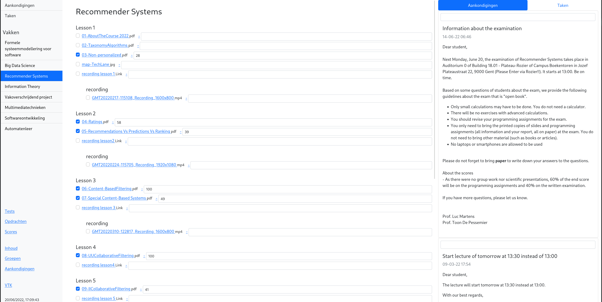

## Ufora content viewer
This is a static html generator for the content, announcements, quizzes and announcements of [Ufora](https://ufora.ugent.be).



#### Why
1. Better overview of all content and announcement
2. Faster navigation and less loading times
3. Single page that doesn't need internet for open book exam

#### How it works
It uses your browsers (which browser can be specified) cookies for authentication and uses the underlying [D2L API](https://docs.valence.desire2learn.com/reference.html) Ufora uses to request all data.

#### Getting started
##### Setting up your environment
``` bash
git clone https://github.com/ToonDN/ufora-content-viewer
cd ufora-content-viewer
pip install -r requirements.txt
```

##### Using the command
`./ufora --output [output directory] --courses [orgunitid1,orgunitid2,...]`

Get the orgunit ids of the courses you want to use. This can be acquired by looking at the url of a course
Example: https://ufora.ugent.be/d2l/home/440412 -> 440412

##### Additional options
Convert filetypes:
`--convert pptx:pdf,ppt:pdf`

This command will download and convert all pptx and ppt files to pdf, this can be usefull to open them in browser.

Supported conversion are pptx:pdf, ppt:pdf, mkv:mp4

Download filetypes:
`--download pdf`
This command will download all files with this extension

#### Configuration
Configurations can be made in the config.py file.

#### Authors usage
##### General usage
Have a cronjob that runs `./ufora --output [output directory] --courses [orgunitid1,orgunitid2,...]` every 30 minutes
Additional benefit is that it refreshes your cookies and you don't have to login as often

##### Open book exam usage
Run `./ufora --output [output directory] --courses [orgunitid] --convert pptx:pdf,ppt:pdf,mkv:mp4 --download png,pdf,html`


